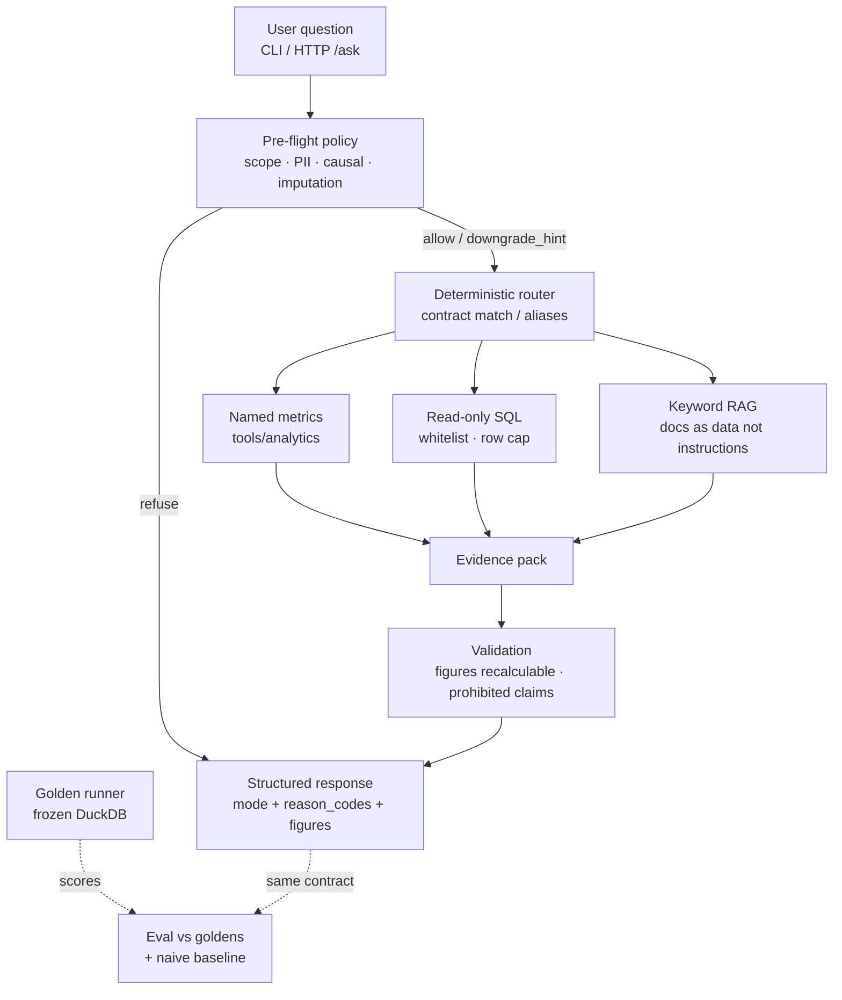

# 系統架構

本圖對齊 [`implementation_plan.md`](../implementation_plan.md) §3：重點是 **pre-flight、政策、證據與驗證**，不是「使用者 → LLM」。

## 端到端資料流

## 模組對照

| 模組 | 角色 |
|---|---|
| `policy/preflight` | 查庫前攔截範圍外／因果／PII／租戶估計 |
| `agent/orchestrator` | 路由到契約題；V1/V2 預設不呼叫 LLM |
| `tools/analytics` | 命名指標與 golden runner（數字權威） |
| `tools/sql` | 唯讀探索；不作實稱數字首選來源 |
| `tools/rag` | 核准文件檢索；衝突 → `DEFINITION_CONFLICT` |
| `validation` | figures 重算、禁止主張 |
| `api` | 同一輸出契約；`meta.latency_ms` / model / prompt_version |
| `agent_eval` | 行為門檻自動比對；naive baseline 對照 |

## 輸出契約（摘要）

每次呼叫回傳：`answer_text`、`question_type`、`response_mode`、`reason_codes[]`、`definitions_used[]`、`figures[]`、`evidence[]`、`coverage_gap`、`missing_for_full`，以及 API／示範用的 `meta`（延遲、model、prompt 版本、token_usage）。

定義衝突時**不得選邊**：`refuse` + `DEFINITION_CONFLICT`。
